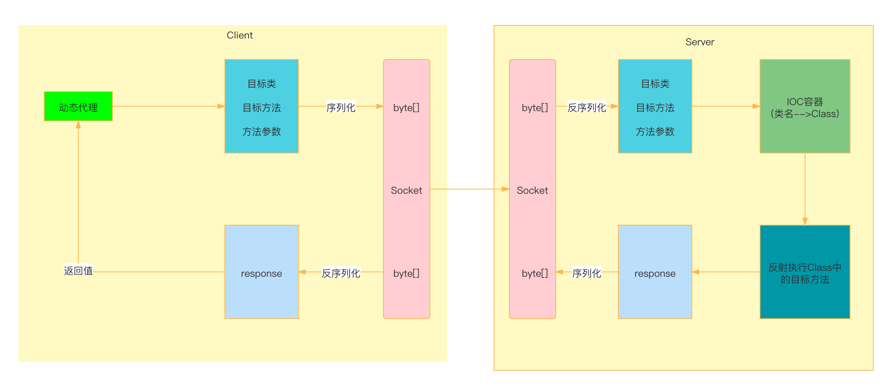

## 架构图

其中包含三大组件：

1. JDK动态代理。
2. Socket网络通信框架。
3. Protobuf序列化/反序列化工具。

使用上述三大组件的理由：

1. 由于客户端和服务端在不同机器的不同JVM进程中，客户端无法直接通过调用本地方法的形式调用远程方法，因此使用JDK动态代理，在代理类中使用Socket访问服务端，并向服务端发送请求；并返回服务端返回的结果。
2. Socket是最简单的BIO网络通信框架，性能不好但是编写简单。
3. 使用Protobuf对客户端/服务端传递的消息进行序列化/反序列化。

