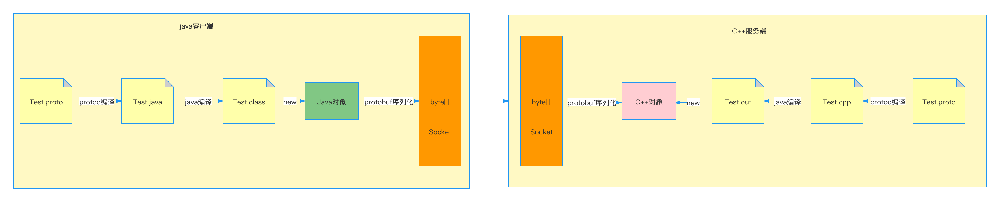
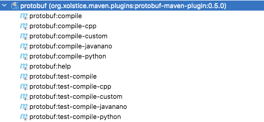

## protobuf概念

protobuf是序列化/反序列化组件，可以按照protobuf语法创建.proto文件，编译该文件，生成不同语言的类，创建该类的对象，将对象序列化/反序列化，从而在不同进程中传输该对象。由于protobuf在序列化/反序列化中采用的编解码协议效率很高，因此网络传输效率很高，同时还能跨语言运行，被广泛使用。

protobuf流程图如下所示：



## idea配置

### plugin
在maven中配置protobuf插件，用于编译.proto文件生成Java/Python/C++等语言的类：
```
    <build>
        <extensions>
            <extension>
                <groupId>kr.motd.maven</groupId>
                <artifactId>os-maven-plugin</artifactId>
                <version>1.5.0.Final</version>
            </extension>
        </extensions>
        <plugins>
            <plugin>
                <groupId>org.xolstice.maven.plugins</groupId>
                <artifactId>protobuf-maven-plugin</artifactId>
                <version>0.5.0</version>
                <configuration>
                    <protocArtifact>
                        com.google.protobuf:protoc:3.1.0:exe:${os.detected.classifier}
                    </protocArtifact>
                    <pluginId>grpc-java</pluginId>
                    <pluginArtifact>
                        io.grpc:protoc-gen-grpc-java:1.11.0:exe:${os.detected.classifier}
                    </pluginArtifact>
                </configuration>
                <executions>
                    <execution>
                        <goals>
                            <goal>compile</goal>
                            <goal>compile-custom</goal>
                        </goals>
                    </execution>
                </executions>
            </plugin>
        </plugins>
    </build>
```
如下，可以将.proto文件编译生成如下类型的类文件：



## 依赖

plugin必须配合以下maven依赖，才能生成正确的Java类：

```
    <dependencies>
        <dependency>
            <groupId>com.google.protobuf</groupId>
            <artifactId>protobuf-java</artifactId>
            <version>3.9.1</version>
        </dependency>
        <dependency>
            <groupId>com.google.protobuf</groupId>
            <artifactId>protobuf-java-util</artifactId>
            <version>3.9.1</version>
        </dependency>
    </dependencies>
```


## 关键语法

### proto文件夹

上述插件默认编译src/main/proto目录下的.proto文件，其他目录下的.proto文件无法编译。因此需要创建src/main/proto目录，并把proto文件全部放到该目录下。

### 名称冲突

.proto文件中java_outer_classname项指定类生成的Java类名。如果没有设置java_outer_classname，那么生成的Java类名默认就是.proto文件名。

即，java_outer_classname或.proto文件为Java外部类名，message名为Java内部类名；二者不能一直，因为在Java中，外部类和内部类不能同名。否则报以下错误：

    protoc did not exit cleanly. Review output for more information.

java_outer_classname设置如下：

    option java_outer_classname = "Student";

### 包名

设置java_package指定生成的Java类的包名。
例如：

    option java_package = "server.proto";

### proto版本
一般使用proto3比较好，特性更多：

    syntax = "proto3";


